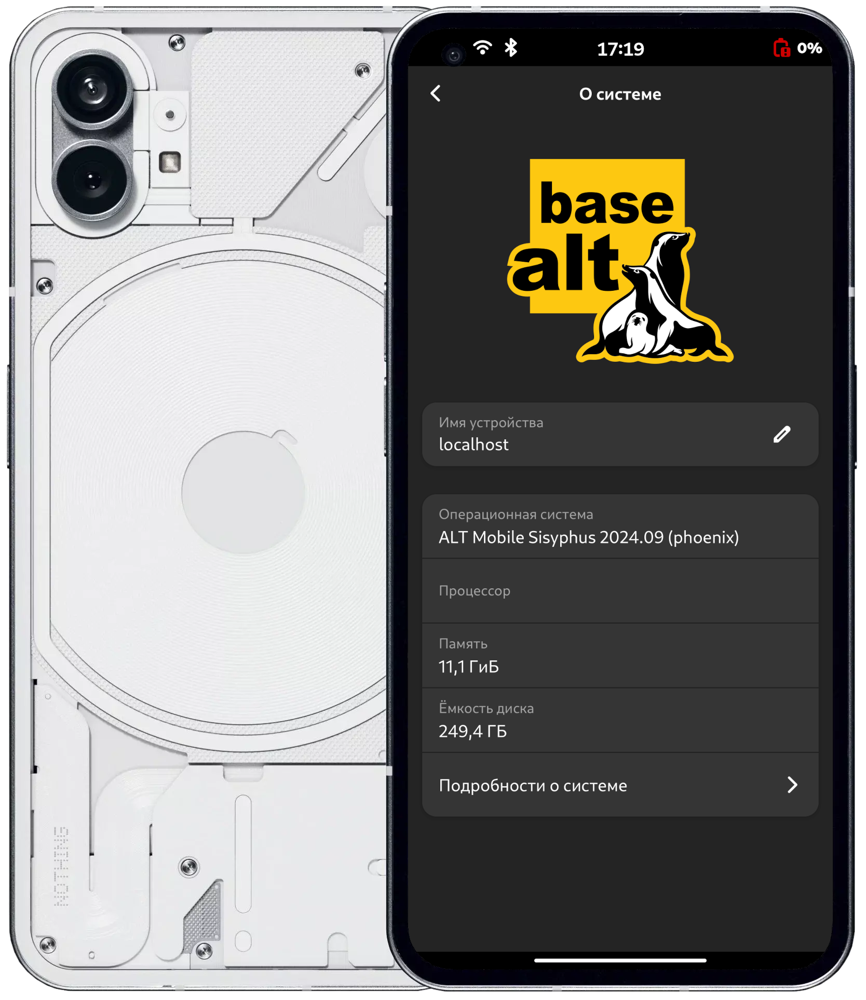
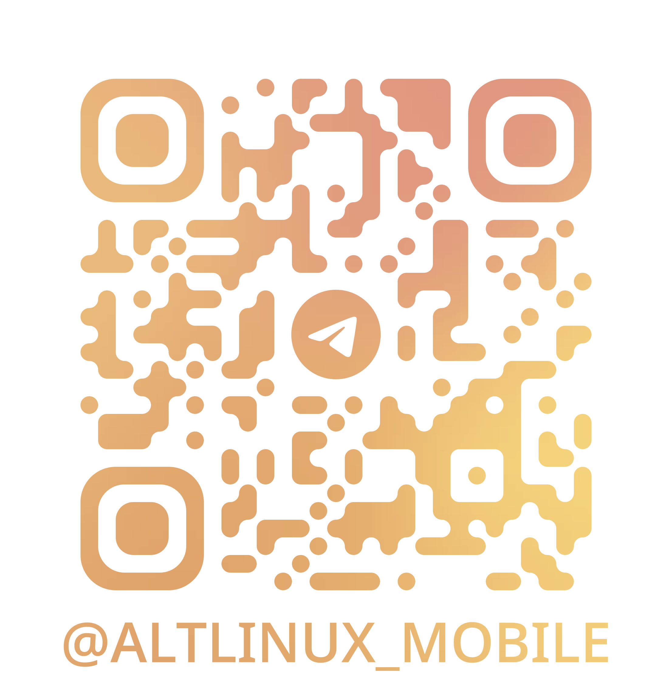

# AltLinux Mobile for Qualcomm Mainline Devices



This repository contains scripts to automate the building of the AltLinux root filesystem (rootfs) and Linux kernel for Qualcomm Mainline devices. It simplifies the setup process, enabling you to quickly prepare a system to run AltLinux on Qualcomm mobile devices.

### Features

- Automated Linux kernel building
- Packaging device-specific firmware and kernel into RPM
- Installing ALSA UCM config
- Building rootfs with pre-installed dependent packages
- Customizable configuration for various Qualcomm devices

## Prerequisites

Ensure your environment meets the following dependencies before building.

### Required Packages by Distribution

#### Ubuntu/Debian
```sh
sudo apt install bash coreutils git tar sed sudo make gcc rpm rpm-build \
gcc-aarch64-linux-gnu bc flex bison libssl-dev libelf-dev libncurses-dev \
libudev-dev libpci-dev libiberty-dev autoconf fastboot
```

#### Fedora/CentOS/RHEL
```sh
sudo dnf install bash coreutils git tar sed sudo make gcc rpm-build \
gcc-aarch64-linux-gnu bc flex bison openssl-devel elfutils-libelf-devel \
ncurses-devel libudev-devel pciutils-devel libiberty-devel autoconf android-tools
```

#### openSUSE
```sh
sudo zypper install bash coreutils git tar sed sudo make gcc rpm-build \
cross-aarch64-gcc bc flex bison libopenssl-devel elfutils-libelf-devel \
ncurses-devel libudev-devel pciutils-devel libiberty-devel autoconf android-tools
```

## Build Instructions

1. Clone the repository:
   ```sh
   git clone https://github.com/altmobile-qcom/altmobile-qcom
   cd altmobile-qcom
   ```

2. Configure your device settings by editing the `deviceinfo` file. Adjust parameters specific to your Qualcomm device model.

3. Run the build script:
   ```sh
   ./build.sh
   ```

The script will automatically handle the rootfs and kernel build process based on your `deviceinfo` configuration.

## Flashing Instructions

Once the build process is complete, you can flash the necessary images to your device.

### Flashing AltLinux

1. Flash the AltLinux root filesystem image:
   ```sh
   fastboot flash linux alt-mobile-phosh-un-def-*-aarch64.img
   ```
   *Note: The `linux` partition in the command is a recommendation. You can select any partition, but it's best to use either a manually created `linux` partition or the existing `userdata` partition. Ensure the selected partition is at least 18GB.*

2. Flash the boot image:
   ```sh
   fastboot flash boot boot.img
   ```

3. For newer devices, clear the `dtbo` and `vendor_boot` partitions:
   ```sh
   fastboot erase dtbo
   fastboot erase vendor_boot
   ```

## Contributing

Contributions are welcome! Feel free to submit issues, fork the repository, and make pull requests to improve functionality or compatibility with more devices.

### Join Us

Connect with the AltLinux Mobile community on [Telegram](https://t.me/altlinux_mobile)!


*Scan this QR code to join the Telegram group*

### Wiki

Don't forget to visit the [Alt Linux Wiki](https://en.altlinux.org/Main_Page).

## License

This project is licensed under the [GPL-3.0 license](LICENSE).
